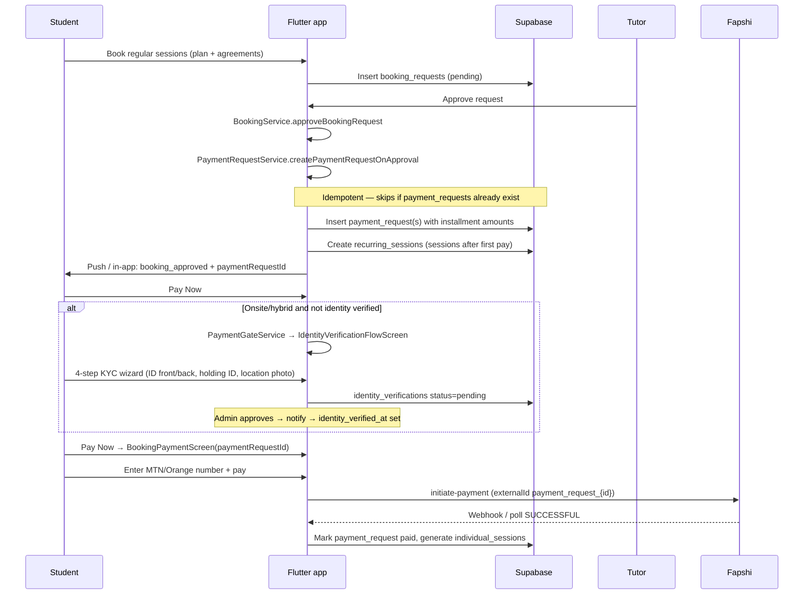
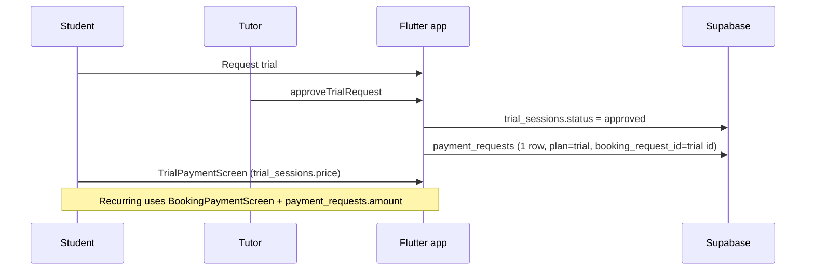

# Launch payments E2E (1:1 only)

**Scope:** Recurring 1:1 bookings and trial sessions. Group-class payments are out of scope.

**Last updated:** May 2026

---

## Flow overview

### Trial (1:1)

---

## Approval → payment request rules

| Payment plan | Rows created | `amount` (per row) | `original_amount` (reference) |
|--------------|-------------|--------------------|-------------------------------|
| monthly | 1 | Full month after 10% discount | Session month + onsite transport |
| biweekly | 2 | Half-month after 5% discount (each) | Full month + transport |
| weekly | 4 | Quarter-month, no discount (each) | Full month + transport |
| trial | 1 | `trial_sessions.price` (no plan discount) | Same as amount |

Onsite/hybrid: transportation = `estimated_transportation_cost × sessions_per_month` added to the monthly base before splitting by plan.

**Idempotency:** If any `payment_requests` row exists for `booking_request_id`, approval reuses the first **pending** installment (lowest `payment_number`); otherwise it does not insert duplicates.

**Code:**

- `lib/features/booking/services/booking_service.dart` — `approveBookingRequest`, `approveTrialRequest`
- `lib/features/payment/services/payment_request_service.dart` — creation + linking
- `lib/features/payment/services/payment_request_amounts.dart` — pure amount math (unit-tested)
- `lib/features/tutor/screens/tutor_requests_screen.dart` — tutor UI (approval delegates to `BookingService`)

---

## Student navigation

| Booking type | Pay screen | ID passed |
|--------------|------------|-----------|
| Recurring 1:1 | `BookingPaymentScreen` | `paymentRequestId` + optional `bookingRequestId` |
| Trial 1:1 | `TrialPaymentScreen` | `TrialSession` (uses trial fee; optional `payment_requests` row for tracking) |

Entry points: **My Requests → Pay Now**, request detail, payment history retry, deep link `/payments/{paymentRequestId}`.

All recurring Pay entry points call `PaymentNavigationHelper.openPayFlow` → `PaymentGateService.resolve`:

| Location | Gate result | Screen |
|----------|-------------|--------|
| `online` | `payment` | `BookingPaymentScreen` |
| `onsite` / `hybrid`, verified | `payment` | `BookingPaymentScreen` |
| `onsite` / `hybrid`, `pending` | `kycPending` | `IdentityVerificationFlowScreen` (read-only) |
| `onsite` / `hybrid`, not submitted / rejected | `kycIntro` | `IdentityVerificationFlowScreen` (4-step wizard) |

**KYC uploads (onsite/hybrid):** ID front, ID back, selfie holding ID, photo of tutoring location. Stored in `identity_verifications` (`holding_id_url`, `location_photo_url` — migration `083`).

**Code:** `payment_gate_service.dart`, `identity_verification_flow_screen.dart`, `kyc_verification_service.dart`, `payment_navigation_helper.dart`.

**Illustration assets** (optional, `assets/images/kyc/`): friendly PrepSkul **bear** mascot — `kyc_intro.png`, `kyc_submitted.png`, `kyc_pending.png`, `kyc_rejected.png`. Prompts: `docs/MASCOT_IMAGE_PROMPTS.md`. No heroes on whose-ID or upload steps.

---

## Manual sandbox test (MTN)

**Prerequisites**

- Flutter app: `Environment: SANDBOX`, Fapshi sandbox base URL in logs.
- Tutor + student test accounts on sandbox Supabase.
- Sandbox MTN test MSISDN (Fapshi docs): commonly `677234567` or the number shown in your Fapshi sandbox dashboard — use a valid 9-digit Cameroon mobile starting with `67` (MTN) or `69` (Orange).

**Steps — recurring onsite bi-weekly**

1. **Student:** Find tutor → Book regular sessions → 2×/week, onsite address, **Pay bi-weekly** → accept Terms + Safeguarding → **Send request**.
2. **Tutor:** Requests → Approve the booking.
3. **Verify DB (optional):** `payment_requests` for `booking_request_id` = 2 rows, `payment_plan` = `biweekly`, `metadata.payment_number` 1 and 2, `amount` ≈ half monthly (with 5% discount), not full month.
4. **Student:** My Requests → **Pay Now** → if not KYC-verified, **Identity verification** wizard (4 uploads) → pending screen → back to requests.
5. **Admin:** `/admin/identity-verifications` → review four document links → **Approve** (user receives in-app + push + email).
6. **Student:** **Pay Now** again → `BookingPaymentScreen` (bi-weekly chips, installment subtotal + 2% charges).
7. Enter sandbox MTN number → **Pay** → approve USSD on device (or use sandbox success flow).
8. Confirm payment success → sessions tab shows generated sessions for the paid period.
9. When second installment is due, student pays `payment_number` 2 (next pending row).

**KYC regression:** Reject with reason → user sees banner on wizard intro; resubmit all four photos. Pay while `pending` always shows pending screen, not checkout.

### KYC notifications (manual)

| Step | Check |
|------|--------|
| Student submits KYC | Each admin gets in-app + push + email (`identity_verification_submitted`); Admin nav → **Identity Verifications** |
| Admin approves | Student gets in-app + push + email (`identity_verification_approved`); tap opens Pay or My Requests |
| Admin rejects with reason | Student notification message includes reason; tap → My Requests |
| Prod | `NEXT_PUBLIC_APP_URL` on PrepSkul Web matches live site (server `fetch` to `/api/notifications/send`) |

**Steps — trial**

1. Student books trial → tutor approves.
2. Student opens **TrialPaymentScreen** (not `BookingPaymentScreen`).
3. Pay trial fee; confirm trial moves to scheduled/paid state.

**Regression checks**

- Approve same booking twice (should fail: status not pending).
- Re-run approval logic with existing `payment_requests` (should not duplicate rows).
- Monthly online: single row, 10% discount on full month.

---

## Related docs

- `docs/LAUNCH_SCOPE.md` — webhook / session-generation gaps
- `docs/PRE_LAUNCH_PRIORITY_PLAN.md` — phase 1 payment foundation
