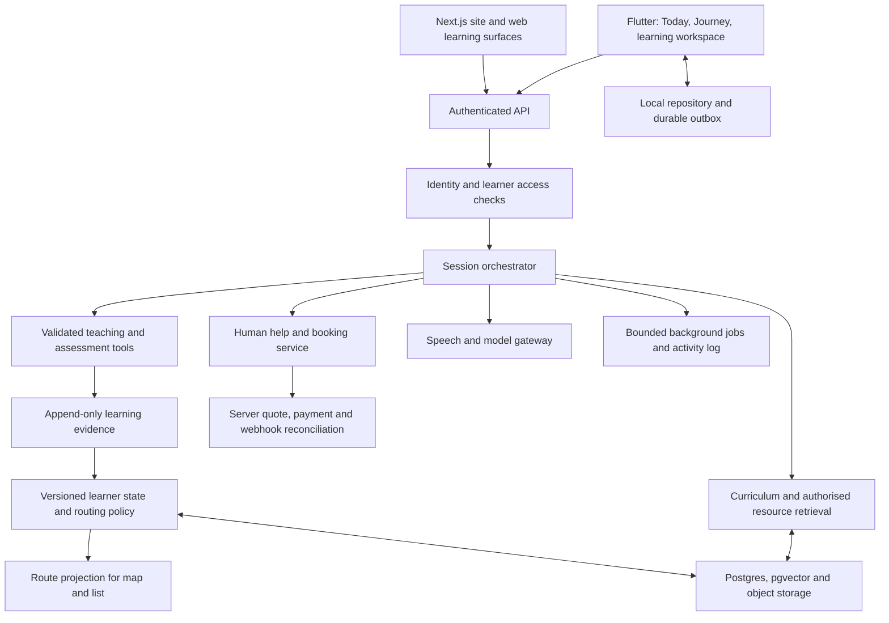

# Engineering and delivery plan

8 October 2026 · Proposed architecture and release gates

Read [the experience plan](LEARNING_EXPERIENCE_PLAN.md) first. This extends the earlier [agentic plan](../SKULMATE_AGENTIC_BUILD_PLAN.md) and [redesign audit](../redesign/SKULMATE_REDESIGN.md). It does not authorise deleting existing booking, learning or payment records. Navigation alternatives remain proposals for prototype testing.

## 1. What the repository actually contains

Inspected in `prepskul_app_delbert` on branch `delbert`:

| Existing component | Evidence | Recommended treatment |
|---|---|---|
| `ConceptMasteryService` | Topic matching, session answer counts, an exponential moving average and weak-topic candidates | Retain as a provisional signal; add item-level evidence, assistance and calibration before using as a mastery probability |
| `SpacedRepetitionService` | Per-item review records and SM-2-lite scheduling | Reuse; distinguish self-rated recall from independently verified application |
| `NextStopService` | Prioritises session follow-up, due review, weak topic, then continuation | Replace scattered priority policy with an explainable, versioned routing service |
| `SessionRouteService` | Extracts a short focus phrase from a tutor summary, with a seven-day dismissal | Preserve continuity, but attach validated concepts and tutor-confirmed outcomes |
| Session cache | Cached session/turn history | Add durable outbox, acknowledgements and identity-scoped cleanup |
| `SkulMateTutorSessionService` | Calls `/api/skulmate/session` and `/api/skulmate/session/turn` | These routes are absent in the inspected website checkout. Reconcile and verify deployment before promising live session functionality |
| Mate widget/GLB and voice services | Shared state mapping and playback-driven reactions | Consolidate; profile memory, WebViews and animation transitions on real devices |
| Flutter + Supabase + Next.js API | Existing product structure | Keep; introduce contracts and bounded services rather than a framework rewrite |

Inspection is not proof that database policies, deployed endpoints or mobile device behaviour are correct. The previous redesign audit already identified the missing session routes; this remains a release dependency until demonstrated otherwise.

A small existing issue to test during routing cleanup: `NextStopService` checks due-review dismissal by review-item ID but dismisses it by game ID. Define one stable suggestion ID and an explicit expiry rather than persisting inconsistent keys.

## 2. Target architecture



Firebase Hosting serves the Flutter web build. It does not deploy the Next.js API, apply Supabase migrations or publish Android/iOS store releases. One deployment manifest must name frontend revision, backend revision, schema version, model/prompt versions, asset version and enabled flags.

## 3. Data contracts

Use migrations with backward compatibility and server ownership checks. Exact table names below are proposals to reconcile with existing schemas.

| Entity | Required fields and constraints |
|---|---|
| Learner | Stable learner ID separate from account/payer; authorised memberships; language/accessibility preferences |
| Goal | Learner, outcome, context, deadline, time budget, status, revision; learner-controlled |
| Curriculum pack | Authority, country/system, subject/level, language, effective version, source rights, review status |
| Concept | Stable ID, definition, scope, aliases and reviewed prerequisite edges; curriculum mappings kept separately |
| Learning event | Unique event/idempotency ID, learner/session/item, timestamp, answer, hints/assistance, evaluator version, source and confidence |
| Concept estimate | Evidence references, uncertainty, recency and estimator version; derived/recomputable |
| Session | Learner, goal, ordered turns, active task, acknowledged sequence, consented attachments |
| Route revision | Goal, learner-state revision, candidate activities, constraints, reasons, alternatives, expiry |
| Memory fact | Value, origin, confidence, scope, consent, expiry/deletion metadata |
| Human handoff | Shared context preview, consent, recipient, availability, lifecycle and retention |
| Agent job | Trigger, owner, allowed tools, budget, status, cancellation, approvals and trace ID |

Do not use map coordinates as concept identity. Do not use a transcript summary as the only record of learning. Store irreversible external action outcomes separately from suggestions.

Example route contract:

```json
{
  "routeId": "route-123",
  "revision": 4,
  "goalId": "goal-456",
  "learnerStateRevision": 12,
  "status": "provisional",
  "currentConceptId": "linear-equation-rearrangement",
  "next": {
    "activityId": "activity-789",
    "reasonCode": "CHECK_POSSIBLE_PREREQUISITE_GAP",
    "explanation": "A short check will help us choose the next explanation.",
    "estimatedMinutes": {"min": 3, "max": 6},
    "offlineAvailable": true
  },
  "alternatives": [],
  "policyVersion": "rules-v1"
}
```

Time is an estimate with uncertainty, not a guaranteed completion time. Server derives the authorised learner scope from authentication and memberships; it does not trust client-supplied IDs.

## 4. Retrieval and reasoning

Use PostgreSQL relations for curricula, prerequisite edges, enrolment and permissions. Use pgvector for semantic retrieval. These solve different problems; a separate graph database is unnecessary until query scale or complexity justifies it.

Ingestion: authorised source → malware/type checks → extraction → chapter/section-aware chunks → version/rights metadata → educator review → embeddings → retrieval evaluation → publish. Superseded content remains traceable but is excluded from current recommendations unless explicitly needed.

Retrieval: resolve learner scope → filter by curriculum/version/language/rights and access policy → keyword plus vector candidates → rerank → include compact attributable passages. Abstain or ask for clarification when no appropriate source exists. Enforce access before context reaches the model. Supabase documents a pgvector/RLS approach for permission-aware retrieval. [Supabase](https://supabase.com/docs/guides/ai/rag-with-permissions).

Treat documents, webpages and uploads as untrusted data. They cannot override tool permissions, change learner identity or instruct the agent to reveal secrets. Sources need provenance and deletion propagation through chunks, embeddings and caches.

Use deterministic or specialised checks where applicable: arithmetic, unit consistency, schema validity and known answer rubrics. An LLM-generated grade needs uncertainty and educator review paths; the same model agreeing with itself is not independent validation.

## 5. Bounded agent workflows

Start with one orchestrator and typed tools. Potential specialisations are intake, curriculum retrieval, teaching, assessment, route planning and handoff. They are responsibilities, not a requirement to run six agents on every turn.

Each tool declares input/output schema, data scope, side effects, timeout, retry policy and budget. Read-only preparation can run in the background; sharing, messages, bookings, payments and voice enrolment need explicit review. Jobs stop on goal cancellation, expiry or budget exhaustion.

Model gateway provides provider isolation, request cancellation, per-learner quotas, cost records and fallback. Route by evaluated task quality/latency; avoid hardcoding a fashionable model as a product dependency. Keep model keys server-side. Never let model output supply SQL, raw payment amounts or arbitrary executable UI.

Structured response: session/turn IDs, sequence, teaching move, display text, spoken text, validated board operations, source references, assessment status and suggested next action. The client renders approved board components. Unknown operations degrade to text without breaking the session.

## 6. Reliable learning and voice

Client repository exposes local state immediately and reconciles with the server. Use an outbox with idempotency, retries with jitter, acknowledged sequence and per-account cleanup. Record offline attempts as pending verification. Merge append-only evidence; use revisions for edits to goals/notes. Avoid last-write-wins for payments or learner identity.

Voice state machine: idle → permission/capture → transcribing → processing → speaking, with interruption/error/reconnect transitions from each relevant state. A generation ID rejects stale callbacks and late audio after a new turn. Captions and text work when audio fails. A cancelled session must release microphone, recognition callbacks and playback.

The map is a projection of the route model; both list and map share commands. Begin with Flutter-native rendering for the small map. If a 3D runtime is later chosen, evaluate startup cost, memory, accessibility bridge and Android/iOS support with a prototype. Keep business logic out of the renderer.

## 7. Release and security findings

The October 8 release inspection found:

- Root `.env` was configured as a downloadable Flutter asset.
- The web environment injector included private Fapshi payment credentials.
- The client payment service sends provider credentials directly.
- Live tutor-session API routes are missing from the inspected website checkout.

The release preparation replaces root environment bundling with a generated public allowlist, rejects a non-anon Supabase JWT, removes private payment variables from browser injection and marks payments unavailable in the review configuration. This is a containment measure, not a completed payment migration. Rotate any credentials previously committed or distributed; removing them from a new bundle does not revoke old copies.

Before live payment release: authenticated server quote and order ownership, server-calculated amount/currency, idempotent initiation, provider credentials in server secret storage, verified webhook reconciliation, explicit pending/failure states, receipts/refunds and duplicate-request tests. No raw general-purpose Fapshi proxy.

Check every other direct external integration that formerly read server secrets from `.env`; do not assume only payment is affected. The safe build must not restore those secrets to regain functionality.

## 8. Delivery sequence and acceptance gates

| Stage | Concrete deliverable | Exit gate |
|---|---|---|
| 0. Release baseline | Safe config, matching API/schema manifest, current app review build | No bundled server secrets; auth/session/payment limitations documented; store IDs unchanged |
| 1. Discovery | Interviews, content inventory, prototype comparisons | First cohort/domain agreed; evidence for default navigation and map usefulness |
| 2. One lesson | Intake → board → guided attempt → independent check → recap/resume | Actual answer changes teaching; cancellation/reconnect preserve work; identity isolation verified |
| 3. Learning route | Reviewed concept graph, evidence model, map/list projection, review queue | Explained next step; no fabricated certainty; map/list action parity |
| 4. Human continuity | Tutor context handoff and follow-up practice | Correct permissions, real availability, quote/payment lifecycle, no duplicate bookings |
| 5. Pilot quality | Educator-reviewed content, language/device/accessibility evaluation | Predefined learning and reliability measures meet agreed thresholds |
| 6. Expand | More curriculum packs, controlled peer circles, bounded proactive jobs | Coverage/review capacity and operating economics support expansion |
| Later | Optional richer 3D, institutional tools, consented familiar voices | Demonstrated demand, measured value and operational readiness |

No dates are promised without staffing and content-review capacity. Content/assessment quality and payment/API reconciliation are dependencies on the critical path. Do not schedule a full-world launch before the vertical slice works.

### First implementation backlog

1. Inventory deployed API routes/migrations against app calls; repair missing session contract.
2. Define active learner identity and add cross-child/account access tests.
3. Remove client-held server secrets and migrate payment operations.
4. Add a typed session envelope and durable resumable state.
5. Implement one reviewed concept sequence and evidence-bearing independent checks.
6. Consolidate mascot/voice controller and verify every transition/prop combination.
7. Prototype Today, Journey and the learning workspace using shared tokens.
8. Introduce versioned routes with reasons, alternatives, dismiss expiry and list parity.
9. Test weak network, offline packs, sync conflicts and interrupted audio.
10. Instrument learning outcomes, handoffs, latency, cost and recoverable errors.

## 9. Evaluation and performance budgets

Proposed initial targets, requiring measurement and revision:

- Local controls visibly respond within 100ms; no full-screen wait for decorative assets.
- Warm cached home usable within 1 second on the selected reference device.
- First useful streamed tutor response p95 under 5 seconds on the declared normal network; show recovery/status if exceeded.
- Audio interruption stops playback within 250ms on supported devices.
- No lost acknowledged turns or duplicate externally charged operations during retries.
- Exactly one active microphone owner and bounded visible mascot rendering.
- All primary flows work with large text, screen reader, keyboard, reduced motion and muted audio.

Test matrix: a low/mid-range Android phone, recent Android, supported iPhone, desktop browser; narrow/landscape/large text; English/French; fresh install and upgrade; shared device switching; denied microphone; expired session; provider failure; 400kbps/500ms RTT and connection loss. Numbers are test conditions, not guaranteed user network characteristics.

Evaluation sets cover curriculum grounding, mathematical correctness, source faithfulness, misconception handling, hint quality, language fit, inappropriate autonomy, prompt injection, cross-learner leakage and cost. Add human educator review; do not score every educational decision with an uncalibrated model judge.

## 10. Operating model

Name owners before launch: product/learning lead, curriculum reviewers, mobile/frontend lead, backend/reliability lead, tutor operations and safeguarding/moderation. One person may hold several roles during the pilot, but responsibility must be explicit.

Track error budgets and unit costs by workflow. Feature flags allow route/voice/model rollback independently. Keep earlier records readable through migrations. Back up data and rehearse restoration. Separate preview, staging and production access; a preview URL is not a data sandbox by itself.
